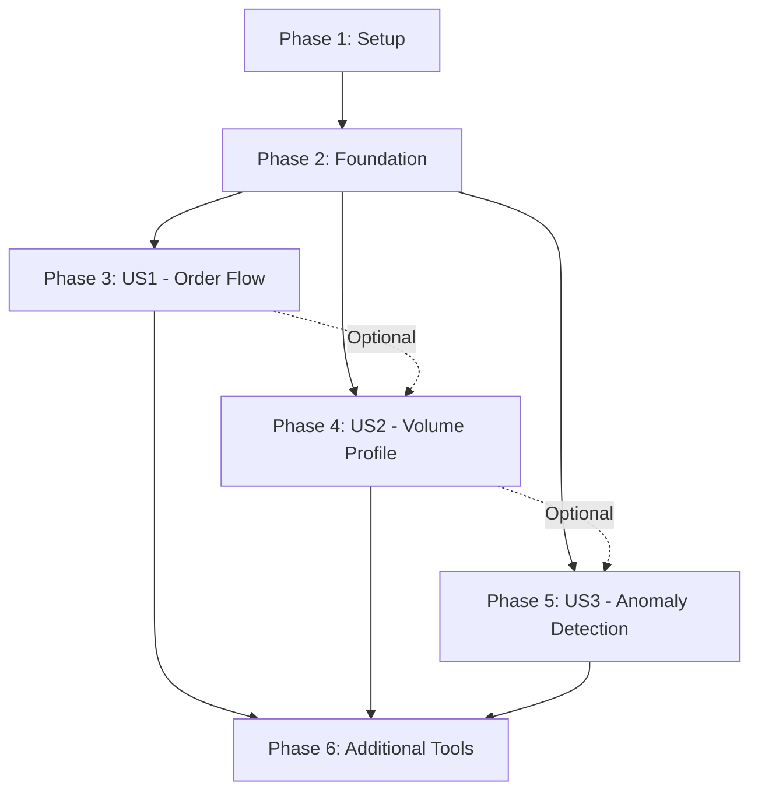

# Implementation Tasks: Advanced Order Book Analytics

**Feature**: 008-orderbook-advanced-analytics
**Branch**: `008-orderbook-advanced-analytics`
**Generated**: 2025-01-18
**Total Tasks**: 42

---

## Task Organization

Tasks are organized by **user story** to enable independent implementation and testing. Each user story phase can be completed independently and delivers a testable increment.

### User Stories (from spec.md):
- **US1** (P1): Order Flow Analysis for Trade Timing
- **US2** (P2): Volume Profile for Support/Resistance Discovery
- **US3** (P3): Market Microstructure Anomaly Detection

---

## Phase 1: Setup (6 tasks)

**Goal**: Initialize project dependencies and feature gate infrastructure.

### Tasks

- [X] T001 Add `rocksdb = "0.23.0"` dependency to Cargo.toml [dependencies] section
- [X] T002 Add `statrs = "0.18.0"` dependency to Cargo.toml [dependencies] section
- [X] T003 Add `rmp-serde = "1.3.0"` dependency to Cargo.toml [dependencies] section (MessagePack serialization)
- [X] T004 Add `uuid = { version = "1.11", features = ["v4", "serde"] }` dependency to Cargo.toml [dependencies] section
- [X] T005 Create `orderbook_analytics` feature in Cargo.toml [features] section extending `orderbook` feature
- [X] T006 Create directory structure: `src/orderbook/analytics/` and `src/orderbook/analytics/storage/`

---

## Phase 2: Foundational Infrastructure (8 tasks)

**Goal**: Build shared storage and type foundations required by all user stories.

### Tasks

- [X] T007 [P] Create `src/orderbook/analytics/mod.rs` with feature gate checks and public API exports
- [X] T008 [P] Create `src/orderbook/analytics/types.rs` with FlowDirection enum (STRONG_BUY, MODERATE_BUY, NEUTRAL, MODERATE_SELL, STRONG_SELL per FR-006)
- [X] T009 [P] Add Severity enum to `src/orderbook/analytics/types.rs` (Low, Medium, High, Critical based on confidence thresholds)
- [X] T010 [P] Add ImpactLevel enum to `src/orderbook/analytics/types.rs` (FastMovement, ModerateMovement, Negligible)
- [X] T011 [P] Add Direction enum to `src/orderbook/analytics/types.rs` (Accumulation, Distribution)
- [X] T012 Create `src/orderbook/analytics/storage/mod.rs` with RocksDB initialization and key format `{symbol}:{unix_timestamp_sec}`
- [X] T013 Implement snapshot capture logic in `src/orderbook/analytics/storage/snapshot.rs` (1-second interval, MessagePack serialization)
- [X] T014 Implement historical query with prefix scan in `src/orderbook/analytics/storage/query.rs` (<200ms target, async with timeout)

---

## Phase 3: User Story 1 - Order Flow Analysis (P1) (8 tasks)

**Story Goal**: Algorithmic traders can see order flow dynamics (bid/ask pressure) to identify optimal entry/exit points.

**Independent Test Criteria**: Request order flow for BTCUSDT over 60 seconds, verify bid_flow_rate, ask_flow_rate, net_flow, and flow_direction are calculated correctly.

### Tasks

- [X] T015 [US1] Add OrderFlowSnapshot struct to `src/orderbook/analytics/types.rs` with fields: symbol, time_window_start/end, window_duration_secs, bid_flow_rate, ask_flow_rate, net_flow, flow_direction, cumulative_delta
- [X] T016 [US1] Create `src/orderbook/analytics/flow.rs` with `calculate_order_flow()` async function signature
- [X] T017 [US1] Implement query_snapshots_in_window() in `flow.rs` using RocksDB prefix scan for time range
- [X] T018 [US1] Implement aggregate_bid_ask_counts() in `flow.rs` counting order additions per side from snapshots
- [X] T019 [US1] Implement calculate_flow_rates() in `flow.rs` dividing counts by duration (orders/sec)
- [X] T020 [US1] Implement determine_flow_direction() in `flow.rs` using FR-006 ratios (>2x = STRONG, 1.2-2x = MODERATE, 0.8-1.2 = NEUTRAL)
- [X] T021 [US1] Implement calculate_cumulative_delta() in `flow.rs` (running sum of buy_volume - sell_volume over window)
- [X] T022 [US1] Create `get_order_flow` MCP tool in `src/orderbook/analytics/tools.rs` implementing contracts/get_order_flow.json schema

---

## Phase 4: User Story 2 - Volume Profile (P2) (10 tasks)

**Story Goal**: Technical analysts can see volume distribution across price levels to identify support/resistance zones.

**Independent Test Criteria**: Request volume profile for ETHUSDT over 24h, verify POC (Point of Control), VAH (Value Area High), VAL (Value Area Low) are identified correctly.

### Tasks

- [X] T023 [P] [US2] Add VolumeProfile struct to `src/orderbook/analytics/types.rs` with histogram, bin_size, bin_count, POC, VAH, VAL fields
- [X] T024 [P] [US2] Add VolumeBin struct to `src/orderbook/analytics/types.rs` (price_level, volume, trade_count)
- [X] T025 [P] [US2] Add LiquidityVacuum struct to `src/orderbook/analytics/types.rs` (vacuum_id, price_range_low/high, volume_deficit_pct, expected_impact)
- [X] T026 [US2] Create `src/orderbook/analytics/trade_stream.rs` with @aggTrade WebSocket connection logic (wss://stream.binance.com:9443/ws/<symbol>@aggTrade)
- [X] T027 [US2] Implement exponential backoff reconnection (1s, 2s, 4s, 8s, max 60s) in `trade_stream.rs`
- [X] T028 [US2] Create `src/orderbook/analytics/profile.rs` with `generate_volume_profile()` async function
- [X] T029 [US2] Implement adaptive_bin_size() in `profile.rs` using formula `max(tick_size × 10, price_range / 100)` (clarification Q1)
- [X] T030 [US2] Implement bin_trades_by_price() in `profile.rs` grouping @aggTrade data into bins
- [X] T031 [US2] Implement find_poc_vah_val() in `profile.rs` (POC = max volume bin, VAH/VAL = 70% volume boundaries)
- [X] T032 [US2] Create `get_volume_profile` MCP tool in `src/orderbook/analytics/tools.rs` implementing contracts/get_volume_profile.json schema

---

## Phase 5: User Story 3 - Anomaly Detection (P3) (8 tasks)

**Story Goal**: Risk managers can detect market microstructure anomalies (quote stuffing, icebergs, flash crashes) to avoid manipulated conditions.

**Independent Test Criteria**: Simulate quote stuffing scenario (>500 updates/sec, <10% fills), verify system detects and flags as "HFT manipulation".

### Tasks

- [ ] T033 [P] [US3] Add MarketMicrostructureAnomaly struct to `src/orderbook/analytics/types.rs` (anomaly_id, type, timestamp, confidence, severity, recommended_action)
- [ ] T034 [P] [US3] Add AnomalyType enum to `src/orderbook/analytics/types.rs` (QuoteStuffing, IcebergOrder, FlashCrashRisk with type-specific metadata)
- [ ] T035 [P] [US3] Add AbsorptionEvent struct to `src/orderbook/analytics/types.rs` (event_id, price_level, absorbed_volume, refill_count, direction)
- [ ] T036 [US3] Create `src/orderbook/analytics/anomaly.rs` with `detect_anomalies()` async function
- [ ] T037 [US3] Implement detect_quote_stuffing() in `anomaly.rs` checking update_rate >500/sec and fill_rate <10% (FR-003)
- [ ] T038 [US3] Implement detect_iceberg_orders() in `anomaly.rs` tracking refill_rate >5x median (FR-004)
- [ ] T039 [US3] Implement detect_flash_crash_risk() in `anomaly.rs` checking depth_loss >80%, spread >10x, cancellation_rate >90% (FR-005)
- [ ] T040 [US3] Create `detect_market_anomalies` MCP tool in `src/orderbook/analytics/tools.rs` implementing contracts/detect_market_anomalies.json schema

---

## Phase 6: Additional Analytics Tools (2 tasks)

**Goal**: Complete remaining MCP tools for comprehensive analytics.

### Tasks

- [ ] T041 Create `get_liquidity_vacuums` MCP tool in `src/orderbook/analytics/tools.rs` implementing contracts/get_liquidity_vacuums.json (FR-008, identifies price ranges with <20% median volume)
- [ ] T042 Create `get_microstructure_health` MCP tool in `src/orderbook/analytics/tools.rs` implementing contracts/get_microstructure_health.json (FR-010, composite 0-100 score combining spread stability, liquidity depth, flow balance, update rate)

---

## Dependencies & Execution Order

### Story Dependencies

**Critical Path**: Setup → Foundation → US1 → Tools (minimum viable product)

**Independence**: US1, US2, US3 can be implemented in parallel after Foundation completes.

### Blocking Tasks (Must Complete First)

1. **T001-T006** (Setup): Must complete before any code can compile
2. **T007-T014** (Foundation): Required by all user stories (storage + core types)
3. **T026-T027** (@aggTrade stream): Required for US2 volume profile

### Parallel Execution Opportunities

**Phase 2 (Foundation):**
- T007-T011 (type definitions) can run in parallel
- T012-T014 (storage layer) sequential (T013-T014 depend on T012)

**Phase 3 (US1):**
- T017-T021 (calculation functions) can run in parallel after T015-T016

**Phase 4 (US2):**
- T023-T025 (type definitions) can run in parallel
- T026-T027 (WebSocket) independent from T028-T031 (profile logic)

**Phase 5 (US3):**
- T033-T035 (type definitions) can run in parallel
- T037-T039 (detection algorithms) can run in parallel after T036

---

## Implementation Strategy

### MVP Scope (Minimum Viable Product)

**Deliver First**: Phase 1 → Phase 2 → Phase 3 (US1) → T041 (liquidity vacuums)

**Why**: US1 (Order Flow) is P1 and provides immediate trading signals. Can ship without US2/US3 for early feedback.

### Incremental Delivery Plan

1. **Sprint 1** (Days 1-3): Setup + Foundation + US1 (T001-T022)
   - **Deliverable**: Order flow analysis working end-to-end
   - **Test**: `get_order_flow` tool returns valid metrics for BTCUSDT

2. **Sprint 2** (Days 4-6): US2 Volume Profile (T023-T032)
   - **Deliverable**: Volume profile with POC/VAH/VAL
   - **Test**: `get_volume_profile` identifies support/resistance zones

3. **Sprint 3** (Days 7-9): US3 Anomaly Detection + Tools (T033-T042)
   - **Deliverable**: Full analytics suite
   - **Test**: All 5 MCP tools functional, anomaly detection >95% precision (SC-003)

### Testing Checkpoints

**After Phase 3 (US1)**:
- ✅ Order flow direction changes detected within 5 seconds (SC-001)
- ✅ Flow calculations complete <100ms (NFR line 174)
- ✅ RocksDB queries <200ms (clarification Q5)

**After Phase 4 (US2)**:
- ✅ Volume profile calculations <500ms for 24h data (SC-002)
- ✅ POC/VAH/VAL correctly identified for ETHUSDT
- ✅ @aggTrade stream reconnects automatically on disconnect

**After Phase 5 (US3)**:
- ✅ Quote stuffing detection >95% precision (SC-003)
- ✅ Iceberg detection >80% accuracy (SC-004)
- ✅ System processes >1000 updates/sec without lag (SC-007)

**After Phase 6 (Final)**:
- ✅ All 5 MCP tools follow JSON Schema contracts
- ✅ Health score correlates >0.7 with 5-min volatility (SC-006)
- ✅ Liquidity vacuum detection >90% accuracy (SC-008)

---

## Performance Targets (from NFR)

| Metric | Target | Validation Method |
|--------|--------|-------------------|
| Order flow calculations | <100ms | Benchmark T022 tool |
| Volume profile generation | <500ms for 24h | Benchmark T032 tool (BTCUSDT/ETHUSDT) |
| Historical snapshot queries | <200ms | Benchmark T014 with 60s window |
| Anomaly detection throughput | >1000 updates/sec | Load test T040 tool |
| Storage per 7 days | 500MB-1GB | Measure RocksDB dir size after 7 days |

---

## Validation Checklist

After completing all tasks, verify:

- [ ] All 42 tasks marked complete
- [ ] All task IDs sequential (T001-T042)
- [ ] All user story tasks have [US1], [US2], or [US3] labels
- [ ] Parallelizable tasks marked with [P]
- [ ] All file paths are explicit (no "implement feature X")
- [ ] Setup/Foundation have NO story labels
- [ ] Each user story independently testable (can ship US1 without US2/US3)
- [ ] Dependency graph shows critical path: Setup → Foundation → US1
- [ ] MVP scope clearly defined (US1 + liquidity vacuums = 23 tasks)

---

## Next Steps

1. **Execute tasks**: Run `/speckit.implement` to auto-execute tasks in dependency order
2. **Verify compilation**: `cargo build --features orderbook_analytics` after each phase
3. **Run tests**: `cargo test --features orderbook_analytics` after US1, US2, US3 complete
4. **Performance validation**: Run benchmarks after Phase 6 (all tools complete)
5. **Integration test**: Test all 5 MCP tools via Claude Desktop after Phase 6

---

**Generated by**: `/speckit.tasks` command
**Spec Version**: 008-orderbook-advanced-analytics (2025-01-18)
**Constitution Check**: ✅ PASS (all 7 principles, see plan.md lines 49-100)
